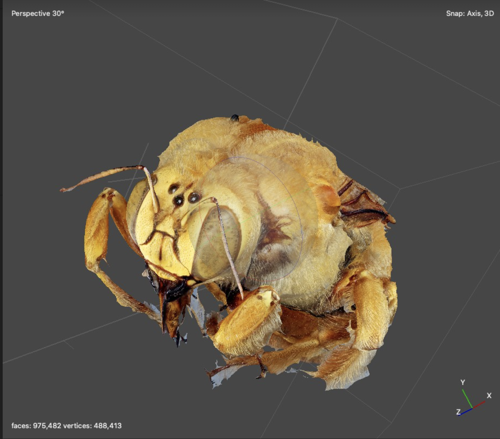
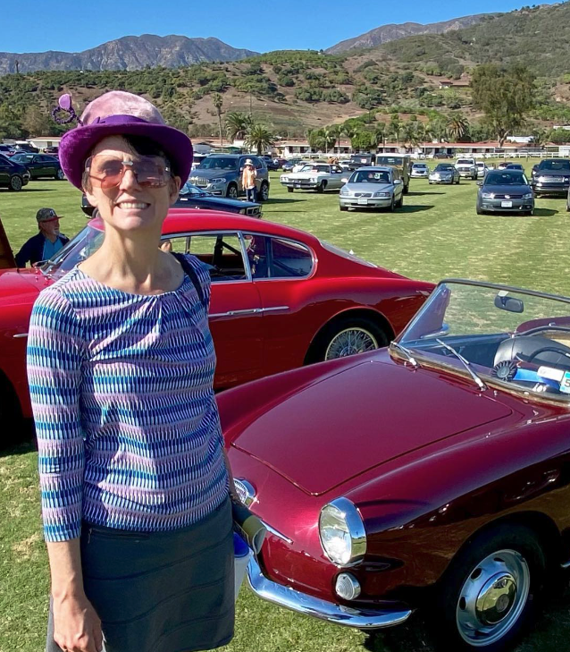

# Automated Wildlife Conservation and Innovation

[```About```](#about) / [```Publications```](#publications) /  [```Team```](#team) / [```Summary```](#summary)


### About

***Our goal is to to create an easy to use, automated, open-source wildlife monitoring system that agricultural producers can use and that can be easily customized by developers and researchers.***

#### Background
While many land agricultural producers wish to act as responsible stewards for biodiversity, there is often a paucity of data available on wildlife populations on their land. The United States Department of Agriculture (USDA), through the National Resource Conservation Service (NRCS), is seeking tractable techological and methodological solutions to this challenge. NRCS has provided support for this project in order to incentivize wildlife conservation by producers and stewards on working lands. Hiring specialist biologists to survey these lands is often prohibitively costly and can complicate activities on working lands. Our chosen solution is to provide site-specific year-long monitoring by pairing machine learning tools to sort images from an automated camera that can be deployed for up to 1 year.


### Publications

[](https://doi.org/10.5281/zenodo.6603940)



 
### Team

#### Chris Evelyn 

***PhD, Assistant Researcher and Vertebrate Curatorial Manager UC Santa Barbara, Cheadle Center for Biodiversity and Ecological Restoration***

Chris is in charge of the development, testing, and validation of the reptile and amphibian devices for this project. Dr. Evelyn is an Assistant Researcher and the Vertebrate Curatorial Manager at UC Santa Barbara who specializes in herpetology and has conducted field research on the ranches in California for more than 15 years. Chris has conducted ecological research on amphibians and reptiles across California and Mexico, offering species identification expertise for training artificial intelligence on the images. Dr. Evelyn’s master’s research explored non-traditional methods for the valuation and profitability of cattle ranches in Monterrey, California. He is currently PI on a sister NRCS CIG project for the state of California. 

#### Doug Bonham
***Collaborator, senior Electronics Engineer, President of Field Data Technologies.***

 He has sixteen years of experience designing instrumentation for high profile wildlife research projects. His wildlife instrumentation projects include custom tracking and behavior logging devices for sharks, sea turtles, whales, condors, eagles, owls, sage grouse, deer, elk, bighorn sheep, beaver and marsupials. He designed novel GPS devices for Microsoft Research as well as eight years of experience on Microsoft’s Surface Pro computers, tablets and dual-screen phones. He was the principal electronics designer for an NSF-funded innovative hybrid GPS wildlife tracking system (NSF Award 1063364) and is currently designing wildlife instrumentation funded by USDA and NOAA. Doug’s bird nest monitoring devices that will be used for this project are being supported by a matching grant from Microsoft’s AI for Earth program. Doug will be the lead electronics engineer for this research and will be responsible for creation of the monitoring system hardware. Doug was the founder and president of Field Data Technologies which is a 401(c)3 nonprofit dedicated to designing and promoting smart camera imaging devices for wildlife field research.

#### Dr. Katja Seltmann



***Ph.D., Associate Researcher & Director of the UC Santa Barbara Cheadle Center for Biodiversity and Ecological Restoration.***

 Katja’s research program is in biodiversity data science and entomology. She studies systematics and morphology of Hymenoptera, and insect ecology in coastal restoration habitats. She is also PI on the [Big-Bee project](http://big-bee.net/) focused on creating 2D and 3D image libraries of bees from natural history collection specimens for computer vision applications. Big-Bee, funded by the National Science Foundation, includes over thirteen institutions in the US. Katja also regularly creates artworks under the name [Irene Moon](https://www.begoniasociety.org/) that bring the aesthetics of the entomology laboratory in front of audiences in the form of absurd, factual presentations about insects, musical recordings, radio, and performances connecting science and fable. Website

### Summary

