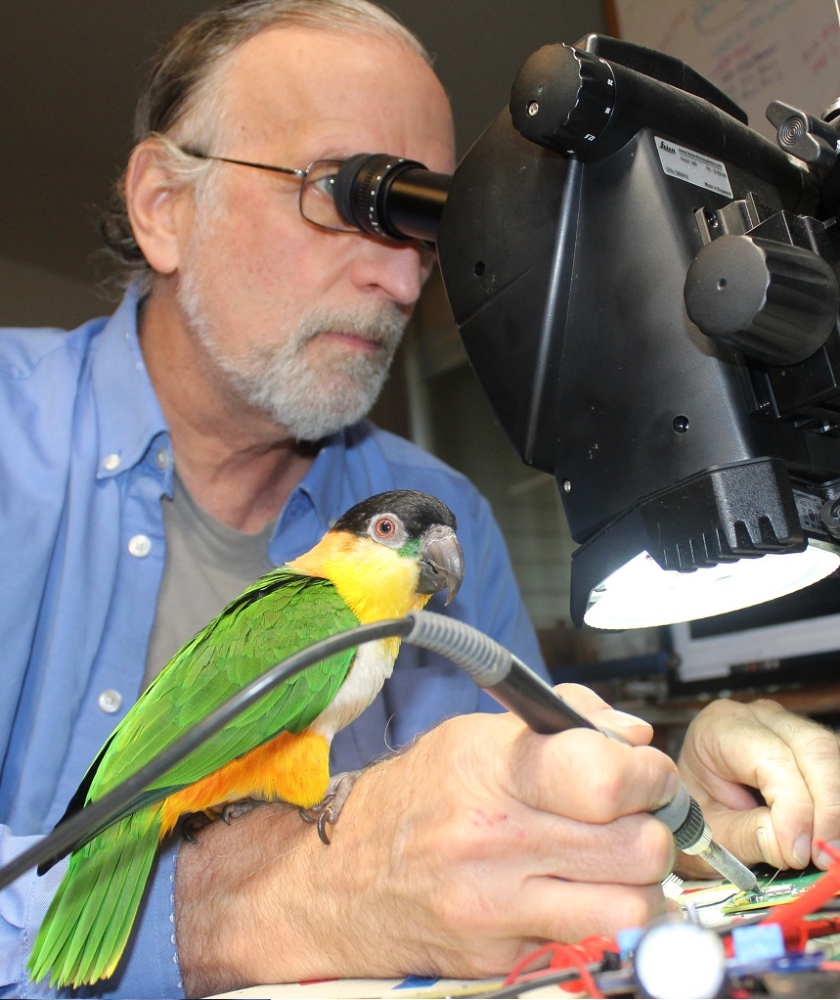

# Resources for Automated Wildlife Research

[```About```](#about) / [```Project```](#project) /  [```Team```](#team) / [```Contact```](#contact)


### About

***Our goal is to to create an easy to use, automated, open-source wildlife monitoring system available for local stakeholders that can be easily customized by developers and researchers.***

### Background
Camera traps allow researchers to essentially be in two places at once for gathering data on their study species. Sorting through camera trap images to find taxa of interest can be a labor-intensive exercise. This is particularly true for small taxa or ectoherms because the trigger system of most camera traps does not detect these taxa reliably. In this project we are exploring methods of detection, data management, and analysis to expand the toolbox for researchers who wish to use camera traps for field studies in ecology or conservation. This reserch is supported by US Department of Agriulture, The Nature Conservancy, Ranchers for Responsible Consesrvation, University of California Santa Barbara, and Texas A&M University.

### Project

[Link to project](./project.html).

 
### Team

#### Chris Evelyn 


***PhD, Assistant Researcher & Vertebrate Curatorial Manager UC Santa Barbara, Cheadle Center for Biodiversity and Ecological Restoration***

Chris Evelyn is a herpetologist with an interest in the evolution of diversity in amphibians and reptiles. His research to date has focused on speciation, morphological evolution, and ecological patterns across spatial scales from microhabitat to biogeography. This has lead him to develop new camera-trap methods for gathering data for species which are difficult to detect in the wild. Chris is passionate about outdoor education and conservation. Before returning to school he taught environmental education on Santa Catalina Island and continues to enjoy outreach and mentoring with students through cooperative projects with NGOs, state agencies, and federal agencies. Chris spent 2018 in Mexico studying parapatric speciation in the salamanders of Oaxaca as a UC Mexus Postdoctoral Fellow.

#### Doug Bonham
***Collaborator, senior Electronics Engineer, President of Field Data Technologies.***



 He has sixteen years of experience designing instrumentation for high profile wildlife research projects. His wildlife instrumentation projects include custom tracking and behavior logging devices for sharks, sea turtles, whales, condors, eagles, owls, sage grouse, deer, elk, bighorn sheep, beaver and marsupials. He designed novel GPS devices for Microsoft Research as well as eight years of experience on Microsoft’s Surface Pro computers, tablets and dual-screen phones. He was the principal electronics designer for an NSF-funded innovative hybrid GPS wildlife tracking system (NSF Award 1063364) and is currently designing wildlife instrumentation funded by USDA and NOAA. Doug’s bird nest monitoring devices that will be used for this project are being supported by a matching grant from Microsoft’s AI for Earth program. Doug will be the lead electronics engineer for this research and will be responsible for creation of the monitoring system hardware. Doug was the founder and president of Field Data Technologies which is a 401(c)3 nonprofit dedicated to designing and promoting smart camera imaging devices for wildlife field research.

#### Dr. Katja Seltmann


***Ph.D., Associate Researcher & Director of the UC Santa Barbara Cheadle Center for Biodiversity and Ecological Restoration.***

 Katja’s research program is in biodiversity data science and entomology. She studies systematics and morphology of Hymenoptera, and insect ecology in coastal restoration habitats. She is also PI on the [Big-Bee project](http://big-bee.net/) focused on creating 2D and 3D image libraries of bees from natural history collection specimens for computer vision applications. Big-Bee, funded by the National Science Foundation, includes over thirteen institutions in the US. Katja also regularly creates artworks under the name [Irene Moon](https://www.begoniasociety.org/) that bring the aesthetics of the entomology laboratory in front of audiences in the form of absurd, factual presentations about insects, musical recordings, radio, and performances connecting science and fable. Website

#### Seth Frazer

***Student Researcher, Ecology Evolution and Marine Biology Department Graduate Student at UC Santa Barbara.***

Seth is a recent graduate of the Biology B.S. program at UCSB, and is now a first year master’s student of the Oakley Lab in the EEMB department. His undergraduate research project focused on the methodology development and execution of generating synthetic image training data of Herpetofauna to train taxonomic/region specific species identification image classifier machine learning models. As a part of his master’s study, Seth is collecting data for and developing a relational database of opsin gene information across a wide-range of taxonomic clades. He will then use this data to build a machine learning model that is capable of predicting the lambda max/peak absorbance values of a given, previously unseen opsin gene. Seth is also a competitive road running athlete, competing in all distances from 5K’s to Marathons. It's through this excursion that he says he is able better balance his mind, body, and scholastic pursuits.

#### Dr. Constance Woodman

***Ph.D., Program Manager, Department of Veterinary Pathobiology at Texas A&M University***

Connie is a PI on two SBIR grants, from USDA and NOAA, to develop wildlife smart camera technology. Her work at Texas A&M involves coordinating multiple university member to create and validate open source smart cameras, funded by the USDA Conservation Innovation Grants program. She works with conservation breeding and breed & release programs. Connie oversees a conservation medicine internship program outside of Austin, TX. By partnering with exotic bird breeders, the internship creates hands-on learning with birds for early career conservation professionals. 

#### Connor Foley

***Undergraduate Student Researcher,, Department of Biochemistry and Entomology at Mississippi State University***

Connor is a junior undergraduate at Mississippi State University. 


### Contact

[**Cheadle Center for Biodiversity and Ecological Restoration**](https://www.ccber.ucsb.edu/)

**Address:** Harder South Building 578, Santa Barbara, CA 93106

**Email:** christopher_evelyn@ucsb.edu


